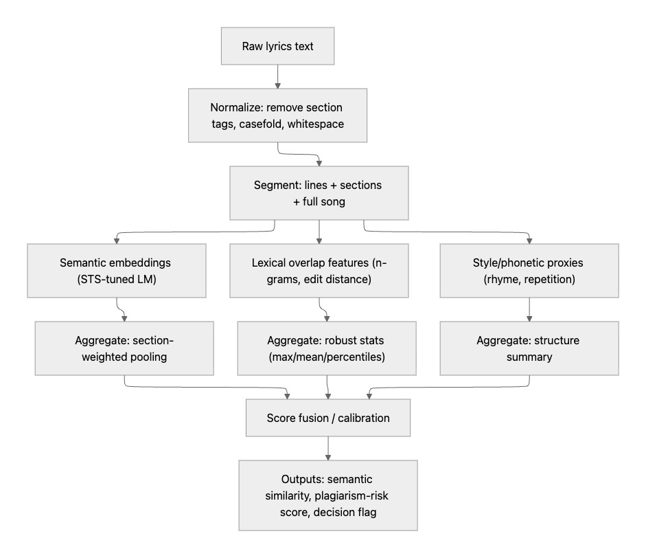
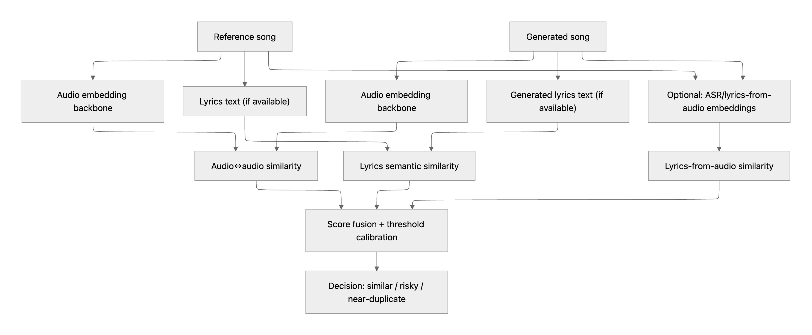

# GenMusic
Generative music detection and evaluation pipeline

---

## Part 1 — Lyric Similarity

**File:** `EVAL/lyrics.py`

Compares two sets of raw lyrics and returns a plagiarism-risk score along with a human-readable decision flag.

### Pipeline Overview



```
Raw lyrics
  └─ Normalize (strip section tags, casefold, whitespace)
       └─ Segment (lines / sections / full song)
            ├─ Semantic embeddings (STS-tuned SentenceTransformer)
            │    └─ Section-weighted pooling  →  semantic_similarity
            ├─ Lexical overlap (unigram/bigram/trigram Jaccard + edit distance)
            │    └─ Robust stats (max, mean, median, p90)  →  lexical_overlap
            └─ Style / phonetic proxies (rhyme scheme, repetition ratio, structure)
                 └─ Structure summary  →  style_similarity
                      └─ Weighted fusion  →  plagiarism_risk_score  +  decision_flag
```

### Outputs

| Field | Type | Description |
|-------|------|-------------|
| `semantic_similarity` | float 0–1 | Cosine similarity of section-weighted embeddings |
| `lexical_overlap` | float 0–1 | N-gram / edit-distance aggregate score |
| `style_similarity` | float 0–1 | Rhyme, repetition, and structure similarity |
| `plagiarism_risk_score` | float 0–1 | Fused score (semantic 45 % · lexical 40 % · style 15 %) |
| `decision_flag` | `"low"` / `"medium"` / `"high"` | Risk level (medium ≥ 0.45, high ≥ 0.75) |

### Quick Start

```bash
# Create and activate virtual environment
python3 -m venv venv
source venv/bin/activate   # Windows: venv\Scripts\activate

# Install dependencies
pip install -r requirements.txt
```

```python
from EVAL.lyrics import LyricsSimilarityChecker

checker = LyricsSimilarityChecker()
result = checker.compare(lyrics_a, lyrics_b)

print(result.decision_flag)          # "low" | "medium" | "high"
print(result.plagiarism_risk_score)  # e.g. 0.6732
print(result.details)                # full breakdown per branch
```

### Sample Output

```
==================================================
  Reference : vertigo_beachfossil.txt
  Candidate : ai_synthetic_vertigo.txt
==================================================
  Semantic similarity   : 0.6842
  Lexical overlap       : 0.2197
  Style similarity      : 0.5538
  Plagiarism risk score : 0.4789
  Decision flag         : MEDIUM
==================================================

Lexical breakdown:
  Unigram Jaccard : 0.1757
  Bigram  Jaccard : 0.0455
  Trigram Jaccard : 0.0168
  Edit similarity : 0.0340
  Line max        : 0.6364
  Line p90        : 0.3776

Style / phonetic breakdown:
  Rhyme similarity      : 0.1250
  Repetition similarity : 0.9711
  Structure similarity  : 1.0000
```

### Dependencies

| Package | Purpose |
|---------|---------|
| `numpy` | Vector math and percentile stats |
| `sentence-transformers` | STS-tuned embedding model (`all-MiniLM-L6-v2` by default) |
| `pronouncing` | CMU pronouncing dict for rhyme fingerprinting |

---

## Part 2 — Music-Aware Similarity

**File:** `EVAL/music_aware.py`

Compares two audio tracks (reference vs. generated) across three parallel branches and fuses them into a single similarity score with a human-readable decision flag.

### Pipeline Overview



```
Reference song                        Generated song
  ├─ Audio embedding backbone           ├─ Audio embedding backbone
  │    └─ CLAP (or MFCC fallback)  →─────────────────────────────→  audio↔audio similarity  [Branch A]
  │
  ├─ Lyrics text (if provided)          ├─ Lyrics text (if provided)
  │    └─ LyricsSimilarityChecker  →────────────────────────────→  lyrics semantic similarity  [Branch B]
  │
  └─ Optional ASR (Whisper)             └─ Optional ASR (Whisper)
       └─ Transcribed lyrics       →─────────────────────────────→  lyrics-from-audio similarity  [Branch C]
                                                                           │
                                              Score fusion + threshold calibration
                                                           │
                                          music_similarity_score  +  decision_flag
                                          "similar" | "risky" | "near-duplicate"
```

### Outputs

| Field | Type | Description |
|-------|------|-------------|
| `audio_similarity` | float 0–1 | Cosine similarity of CLAP audio embeddings |
| `lyrics_similarity` | float 0–1 / NaN | Part 1 plagiarism risk score on supplied lyrics |
| `lyrics_from_audio_similarity` | float 0–1 / NaN | Part 1 score on Whisper-transcribed lyrics |
| `music_similarity_score` | float 0–1 | Fused score (audio 40 % · lyrics 35 % · asr 25 %) |
| `decision_flag` | `"similar"` / `"risky"` / `"near-duplicate"` | Risk level (risky ≥ 0.45, near-duplicate ≥ 0.75) |

### Quick Start

```bash
# (same venv as Part 1)
pip install -r requirements.txt
```

```python
from EVAL.music_aware import MusicAwareSimilarityChecker

checker = MusicAwareSimilarityChecker()

# Audio only
result = checker.compare("ref_song.mp3", "gen_song.mp3")

# Audio + pre-supplied lyrics
result = checker.compare(
    "ref_song.mp3", "gen_song.mp3",
    lyrics_ref="ref_lyrics.txt",
    lyrics_gen="gen_lyrics.txt",
)

print(result.decision_flag)           # "similar" | "risky" | "near-duplicate"
print(result.music_similarity_score)  # e.g. 0.5821
print(result.details)                 # full per-branch breakdown
```

### Sample Output

```
==================================================
  Reference : original_track.mp3
  Candidate : ai_generated_track.mp3
==================================================
  Audio similarity              : 0.7341
  Lyrics similarity             : 0.4789
  Lyrics-from-audio similarity  : 0.5102
  Music similarity score        : 0.5937
  Decision flag                 : RISKY
==================================================

Audio branch:
  Embedding dim : 512
  Backend       : CLAP (laion/larger_clap_music)

Lyrics branch:
  Semantic similarity : 0.6842
  Lexical overlap     : 0.2197
  Style similarity    : 0.5538
  Lyrics decision     : medium

ASR branch:
  Semantic similarity : 0.5910
  Lexical overlap     : 0.1843
  Transcribed ref     : "I feel the vertigo..."
  Transcribed gen     : "I sense the dizziness..."
```

### Dependencies

| Package | Purpose |
|---------|---------|
| `librosa` | Audio loading and MFCC fallback embeddings |
| `openai-whisper` | ASR lyrics extraction from audio (Branch C) |
| `laion_clap` | CLAP audio embeddings — primary backend (Branch A) |
| `torch` | Required by CLAP and Whisper |
| `transformers` | HuggingFace CLAP fallback backend |
